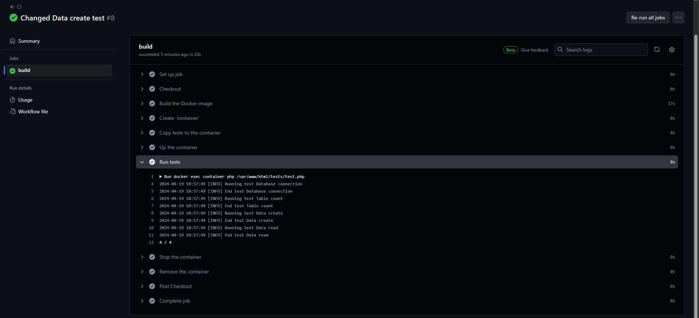

Лабораторная рвбота №8 Непрерывная интеграция с помощью Github Actions
======================================================================

[](https://github.com/Tasha290929/containers07/blob/main/readme.md#%D0%BB%D0%B0%D0%B1%D0%BE%D1%80%D0%B0%D1%82%D0%BE%D1%80%D0%BD%D0%B0%D1%8F-%D1%80%D0%B2%D0%B1%D0%BE%D1%82%D0%B0-8-%D0%BD%D0%B5%D0%BF%D1%80%D0%B5%D1%80%D1%8B%D0%B2%D0%BD%D0%B0%D1%8F-%D0%B8%D0%BD%D1%82%D0%B5%D0%B3%D1%80%D0%B0%D1%86%D0%B8%D1%8F-%D1%81-%D0%BF%D0%BE%D0%BC%D0%BE%D1%89%D1%8C%D1%8E-github-actions)

Цель работы
-----------

[](https://github.com/Tasha290929/containers07/blob/main/readme.md#%D1%86%D0%B5%D0%BB%D1%8C-%D1%80%D0%B0%D0%B1%D0%BE%D1%82%D1%8B)

В рамках данной работы студенты научатся настраивать непрерывную интеграцию с помощью Github Actions.

Задание
-------

[](https://github.com/Tasha290929/containers07/blob/main/readme.md#%D0%B7%D0%B0%D0%B4%D0%B0%D0%BD%D0%B8%D0%B5)

Создать Web приложение, написать тесты для него и настроить непрерывную интеграцию с помощью Github Actions на базе
контейнеров.

### Выполнение

[](https://github.com/Tasha290929/containers07/blob/main/readme.md#%D0%B2%D1%8B%D0%BF%D0%BE%D0%BB%D0%BD%D0%B5%D0%BD%D0%B8%D0%B5)

Создайте репозиторий containers07 и скопируйте его себе на компьютер.

В директории containers07 создайте директорию ./site. В директории ./site будет располагаться Web приложение на базе
PHP.

### Создание Web приложения

[](https://github.com/Tasha290929/containers07/blob/main/readme.md#%D1%81%D0%BE%D0%B7%D0%B4%D0%B0%D0%BD%D0%B8%D0%B5-web-%D0%BF%D1%80%D0%B8%D0%BB%D0%BE%D0%B6%D0%B5%D0%BD%D0%B8%D1%8F)

Создайте в директории ./site Web приложение на базе PHP со следующей структурой:

```yaml
site
├── modules/
│   ├── database.php
│   └── page.php
├── templates/
│   └── index.tpl
├── styles/
│   └── style.css
├── config.php
└── index.php
```

Файл `modules/database.php` содержит класс `Database` для взаимодействия с базой данных SQLite. Вот его методы:

1. `__construct($path)` - создает экземпляр класса Database с указанием пути к файлу базы данных SQLite.
2. `Execute($sql)` - выполняет SQL-запрос.
3. `Fetch($sql)` - выполняет SQL-запрос и возвращает результат в виде ассоциативного массива.
4. `Create($table, $data)` - создает запись в указанной таблице с данными из ассоциативного массива и возвращает
   идентификатор созданной записи.
5. `Read($table, $id)` - возвращает запись из таблицы по указанному идентификатору.
6. `Update($table, $id, $data)` - обновляет запись в указанной таблице по указанному идентификатору данными из
   ассоциативного массива.
7. `Delete($table, $id)` - удаляет запись из указанной таблицы по указанному идентификатору.
8. `Count($table)` - возвращает количество записей в указанной таблице.

Файл `modules/page.php` содержит класс Page для работы со страницами. Вот его методы:

Файл styles/style.css содержит стили для страницы.

Файл index.php содержит код для отображения страницы. Примерный код для файла index.php:

```php
<?php

require_once __DIR__ . '/modules/database.php';
require_once __DIR__ . '/modules/page.php';

require_once __DIR__ . '/config.php';

$db = new Database($config["db"]["path"]);

$page = new Page(__DIR__ . '/templates/index.tpl');

// bad idea, not recommended
$pageId = $_GET['page'];

$data = $db->Read("page", $pageId);

echo $page->Render($data);
```

`config.php` - конфигурационный файл.

### Подготовка SQL файла для базы данных

[](https://github.com/Tasha290929/containers07/blob/main/readme.md#%D0%BF%D0%BE%D0%B4%D0%B3%D0%BE%D1%82%D0%BE%D0%B2%D0%BA%D0%B0-sql-%D1%84%D0%B0%D0%B9%D0%BB%D0%B0-%D0%B4%D0%BB%D1%8F-%D0%B1%D0%B0%D0%B7%D1%8B-%D0%B4%D0%B0%D0%BD%D0%BD%D1%8B%D1%85)

Создайте в корневом каталоге директорию ./sql. В созданной директории создайте файл schema.sql со следующим содержимым:

```sql
CREATE TABLE page
(
    id      INTEGER PRIMARY KEY AUTOINCREMENT,
    title   TEXT,
    content TEXT
);

INSERT INTO page (title, content)
VALUES ('Page 1', 'Content 1');
INSERT INTO page (title, content)
VALUES ('Page 2', 'Content 2');
INSERT INTO page (title, content)
VALUES ('Page 3', 'Content 3');
```

### Создание тестов

[](https://github.com/Tasha290929/containers07/blob/main/readme.md#%D1%81%D0%BE%D0%B7%D0%B4%D0%B0%D0%BD%D0%B8%D0%B5-%D1%82%D0%B5%D1%81%D1%82%D0%BE%D0%B2)

Создайте в корневом каталоге директорию ./tests. В созданном каталоге создайте файл testframework.php со следующим
содержимым:

```php
<?php

function message($type, $message) {
    $time = date('Y-m-d H:i:s');
    echo "{$time} [{$type}] {$message}" . PHP_EOL;
}

function info($message) {
    message('INFO', $message);
}

function error($message) {
    message('ERROR', $message);
}

function assertExpression($expression, $pass = 'Pass', $fail = 'Fail'): bool {
    if ($expression) {
        info($pass);
        return true;
    }
    error($fail);
    return false;
}

class TestFramework {
    private $tests = [];
    private $success = 0;

    public function add($name, $test) {
        $this->tests[$name] = $test;
    }

    public function run() {
        foreach ($this->tests as $name => $test) {
            info("Running test {$name}");
            if ($test()) {
                $this->success++;
            }
            info("End test {$name}");
        }
    }

    public function getResult() {
        return "{$this->success} / " . count($this->tests);
    }
}
```

Создайте в директории ./tests файл test.php со следующим содержимым:

```php
<?php

require_once __DIR__ . '/testframework.php';

require_once __DIR__ . '/../config.php';
require_once __DIR__ . '/../modules/database.php';
require_once __DIR__ . '/../modules/page.php';

$testFramework = new TestFramework();
// test 1: check database connection
function testDbConnection()
{
    global $config;
    $database = new Database($config['db']['path']);
    if ($database) {
        return "Database connection test passed.";
    } else {
        return "Database connection test failed.";
    }
}

// test 2: test count method
function testDbCount()
{
    global $config;
    $database = new Database($config['db']['path']);

    // Проверяем, существует ли таблица 'page'
    $result = $database->Fetch("SELECT name FROM sqlite_master WHERE type='table' AND name='page'");
    if (empty($result)) {
        return "Count test failed: table 'page' does not exist.";
    }

    $count = $database->Count('page');
    if ($count >= 0) {
        return "Count test passed. Count: $count";
    } else {
        return "Count test failed.";
    }
}


// test 3: test create method
function testDbCreate()
{
    global $config;
    $database = new Database($config['db']['path']);

    $result = $database->Fetch("SELECT name FROM sqlite_master WHERE type='table' AND name='page'");
    if (empty($result)) {
        return "Count test failed: table 'page' does not exist.";
    }

    $data = array(
        'name' => 'Test name',
        'content' => 'Test Content'
    );
    $id = $database->Create('page', $data);
    if ($id > 0) {
        return "Create test passed. New row ID: $id";
    } else {
        return "Create test failed.";
    }
}

// test 4: test read method
function testDbRead()
{
    global $config;
    $database = new Database($config['db']['path']);

    $result = $database->Fetch("SELECT name FROM sqlite_master WHERE type='table' AND name='page'");
    if (empty($result)) {
        return "Count test failed: table 'page' does not exist.";
    }

    $id = 1; // change this to the ID of the row you want to read
    $data = $database->Read('page', $id);
    if ($data) {
        return "Read test passed. Data: " . print_r($data, true);
    } else {
        return "Read test failed.";
    }
}

// add tests
$testFramework->add('Database connection', 'testDbConnection');
$testFramework->add('Table count', 'testDbCount');
$testFramework->add('Data create', 'testDbCreate');
$testFramework->add('Data read', 'testDbRead');

// run tests
$testFramework->run();

echo $testFramework->getResult();
```

Добавьте в файл`./tests/test.php`тесты для всех методов класса Database, а также для методов класса Page.

Настройка Github Actions Создайте в корневом каталоге репозитория файл`.github/workflows/main.yml`со следующим
содержимым:

```yaml
name: CI

on:
  push:
    branches:
      - main

jobs:
  build:
    runs-on: ubuntu-latest
    steps:
      - name: Checkout
        uses: actions/checkout@v4
      - name: Build the Docker image
        run: docker build -t containers07 .
      - name: Create `container`
        run: docker create --name container --volume database:/var/www/db containers07
      - name: Copy tests to the container
        run: docker cp ./tests container:/var/www/html
      - name: Up the container
        run: docker start container
      - name: Run tests
        run: docker exec container php /var/www/html/tests/tests.php
      - name: Stop the container
        run: docker stop container
      - name: Remove the container
        run: docker rm container
```

### Запуск и тестирование

[](https://github.com/CalinNicolai/containers07/actions)


